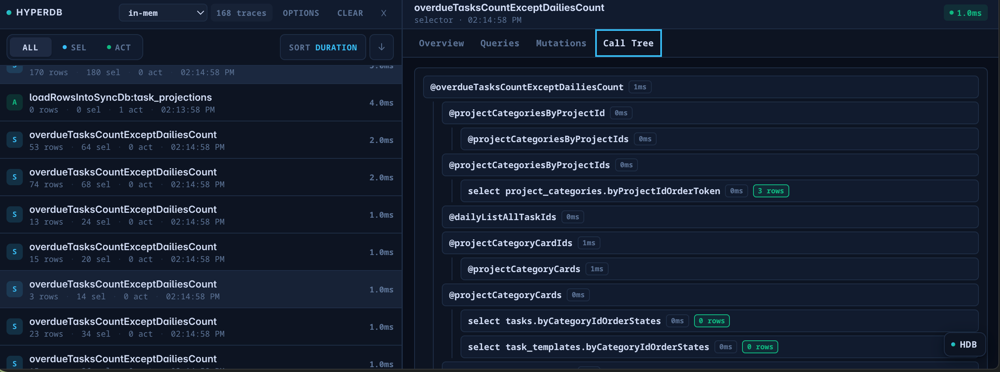

HyperDB can record a **trace** of every selector run and mutation, and ships an
in-app devtool to browse them. Tracing is what powers the devtool, but you can
also configure it independently.



## The devtool panel

The devtool is exported from `@will-be-done/hyperdb-lib/devtool`. Render
`HyperDBDevtools` anywhere in your tree; it can read the database from
[`DBProvider`](/integrations/react/) context, or take an explicit `db` prop.

```tsx
import { DBProvider } from "@will-be-done/hyperdb-lib/react";
import { HyperDBDevtools } from "@will-be-done/hyperdb-lib/devtool";
import { db } from "./db";

export function App() {
  return (
    <DBProvider value={db}>
      <YourApp />
      <HyperDBDevtools db={db} initialIsOpen={false} />
    </DBProvider>
  );
}
```

### `HyperDBDevtools` props

| Prop | Description |
| --- | --- |
| `db` | The `SubscribableDB` to inspect (defaults to context) |
| `initialIsOpen` | Whether the panel starts open (persisted in `localStorage`) |
| `position` | `"top"` \| `"bottom"` \| `"left"` \| `"right"` |
| `buttonPosition` | Corner for the toggle button |
| `maxTraces` | Maximum number of traces to retain |
| `theme` | `"dark"` \| `"light"` \| `"system"` |

There is also `HyperDBDevtoolsPanel` for embedding the panel directly (without
the floating toggle), with an `embedded` flag and an `onClose` callback.

## Tracing

Each selector and action run produces a **root trace** containing the nested
selector frames, the index ranges scanned, and the mutations performed. Cache
hits are recorded too, so you can see when a selector was reused instead of
recomputed.

### Per-DB tracer

Set a tracer when constructing a [`DB`](/runtime/db/). Pass the shared store, the
string `"default"`, or `"disabled"`.

```ts
import { DB, hyperDBTraceStore } from "@will-be-done/hyperdb-lib";

const db = new DB(driver, { tracer: hyperDBTraceStore });
```

### Global default tracer

To enable tracing for all databases that don't specify their own, set the global
default:

```ts
import { setDefaultHyperDBTracer, hyperDBTraceStore } from "@will-be-done/hyperdb-lib/tracing";

setDefaultHyperDBTracer(hyperDBTraceStore);
```

### Trace options

Selector and action factories accept a `trace` option (`{ enabled, startOn }`):

```ts
import { createSelector } from "@will-be-done/hyperdb-lib";

const selector = createSelector({
  trace: { enabled: true, startOn: "devtoolOpen" },
});
```

| Field | Values | Meaning |
| --- | --- | --- |
| `enabled` | `boolean` (default `true`) | Whether this factory's commands are traced |
| `startOn` | `"devtoolOpen"` (default) \| `"load"` | When to begin collecting traces |

`startOn: "devtoolOpen"` keeps overhead near zero until you actually open the
devtool; `"load"` traces from startup.

### Skipping traces per command

Individual selectors and actions can opt out with `skipTrace`:

```ts
selector({
  name: "hotPathSelector",
  args: {},
  skipTrace: true, // or { rootTrace: boolean, childTrace: boolean }
  handler: function* () { /* ... */ },
});
```

Use `skipTrace` on extremely hot paths where even tracing metadata is measurable,
or to keep noisy internal selectors out of the devtool.
